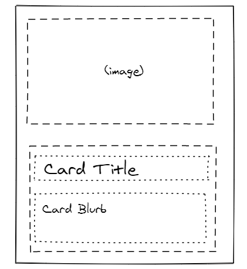

# portfolio

## What is Portfolio

This is an online portfolio template based around cards that reformat
responsively to different screen resolutions.

Feel free to play around with screen sizes!

## Layout Details

Larger screens will see three columns of cards, each displaying a stacked
thumbnail, title, and text
describing each project.

As screen size shrinks, the cards switch to an inline
style where the thumbnail flips to the left of a stacked title and text.

Once the screen size shrinks to mobile-device resolutions, the cards are
simplified with the thumbnail turning into a slim banner stacked on top of the
title.

The template is built on a Bootstrap4 system, and relies on both grid design for breakpoints, as well as flex design for responsive wrapping. 

The cards themselves are based on the Bootstrap4 cards idea, but do not inherit from or directly override the Bootstrap4 cards.

## Design & UX

The design goal is to build a template portfolio specifically for presenting a full set of projects, unlike a portfolio site which might feature a selection of projects and thus devote more space to each project. Here the emphasis is to provide enough information to both distinguish and engage the user quickly. The visuals design places the emphasis on the project title and description: in code projects, the visuals are included to compliment the text description by visually engaging users- as opposed to an art portfolio, for example, where titles and descriptions typically compliment the visuals themselves.

## Future Goals

There are several objectives for continued development: 
- Add a tag system so each project can categorized based on tech stack used.
- Add sorting and filtering of projects/cards based on its tech stack.
- Add card buttons to link to actual project landing sites.